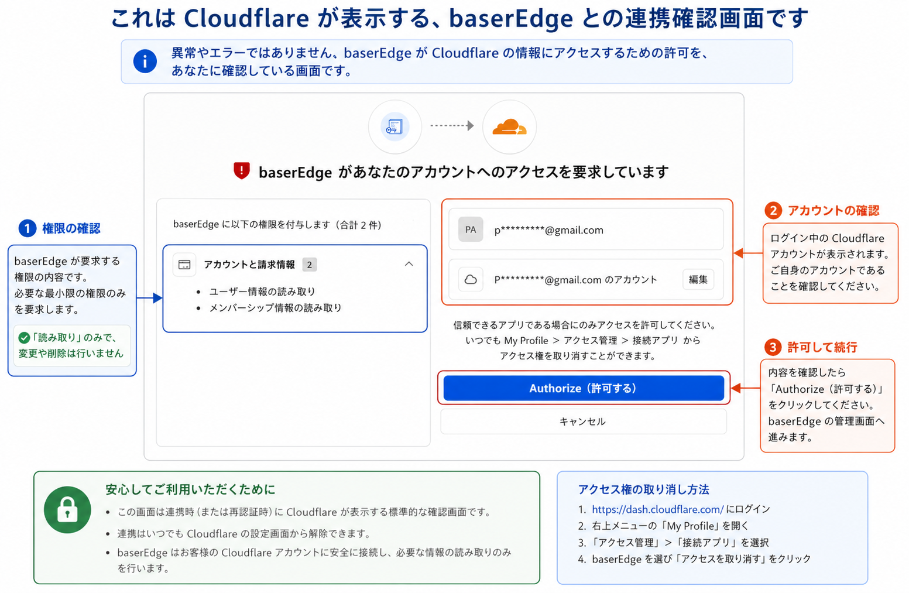
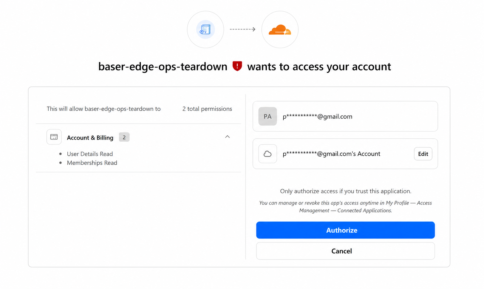

# baserEdge

**baserEdge** は、Cloudflare 上で動くサイトツリー型CMSです。固定ページ、フォルダ、ブログ、メールフォーム、カスタムコンテンツを一つのツリーで管理し、編集・承認・公開までをブラウザで行えます。

[ブラウザで試す](https://baser-edge-trial-host.papehiko.workers.dev/start/) · [利用ガイド](docs/user-guide.md) · [ドキュメント一覧](docs/README.md)

> **現在は v0.9 Preview です。** お試しサイトは自分のCloudflareアカウント内に作られます。通常のお試しにGitHubアカウント、コマンド操作、npm、Wrangler、APIトークンは必要ありません。重要なデータを置く前に、バックアップとCloudflare側の利用状況を確認してください。

## まず試す

必要なのはCloudflareアカウントだけです。

1. [お試し開始ページ](https://baser-edge-trial-host.papehiko.workers.dev/start/)を開く
2. **Cloudflareでログインしてサイトを開設**を押す
3. Cloudflareでアカウントと権限を確認し、**Authorize（許可する）**を押す
4. 開設が完了するまで画面を閉じずに待つ
5. 表示された**管理画面URL**を開き、開設時と同じCloudflareアカウントでログインする

完了画面には2つのURLが表示されます。

| URL | 用途 |
|---|---|
| 管理画面URL（末尾が`/console/`） | ページの作成、編集、承認、公開 |
| 公開サイトURL | 訪問者が見るサイト。最初から公開済みの`/home`があります |

## Cloudflareの確認画面で迷ったら

Cloudflareの確認画面は、異常やエラーではありません。baserEdgeとの連携内容を本人に確認するための標準画面です。`dash.cloudflare.com`であること、ログイン中のアカウント、表示された権限を確認してから許可してください。

| 直前の操作 | 確認画面の目的 |
|---|---|
| お試しサイトを開設 | 利用者のアカウント内にWorkerとD1を作る |
| 管理画面へログイン | 本人と所属アカウントを確認する。`User Details Read`と`Memberships Read`の読み取り2権限だけ |
| **お試しをやめる** | 作成済みの`trial`環境を削除する。削除後は復元不可 |

管理画面ログインでは、現在のプレビュー用OAuthアプリ名として `baser-edge-ops-teardown` と表示される場合があります。管理画面URLから進み、権限が上記の読み取り2件だけなら、WorkerやD1の変更・削除は行いません。削除は開始ページで自分から**お試しをやめる**を選んだ場合だけ始まります。



<details>
<summary>実際の英語表示例を見る</summary>



</details>

内容に問題がなければ **Authorize** を押すと管理画面へ戻ります。連携はCloudflareの **My Profile → Access Management → Connected Applications** からいつでも取り消せます。

## 最初のページを編集する

1. 管理画面で**コンテンツ**を開く
2. サイトツリーの**ホーム**を選ぶ
3. タイトルや本文を編集して保存する
4. 承認・公開し、公開サイトURLで確認する

保存しただけでは公開中の内容は変わりません。編集内容はRevisionとして分けて保持され、承認・公開した内容だけが公開サイトへ反映されます。

## お試し前に知っておくこと

- 標準のお試しはR2なしです。ページや管理画面は試せますが、アップロード画像を公開サイトで配信するにはR2が必要です。
- AI Agentは変更案と承認依頼を作れますが、既定のポリシーでは直接公開できません。
- 不要になった環境は、開始ページの**お試しをやめる**から削除できます。削除対象は`trial`環境に限定され、削除後は復元できません。
- baserCMS 5のPHP実行環境や自動移行機能は含みません。詳しくは[baserCMSとの関係](docs/compatibility/relationship-to-basercms.md)を参照してください。

## 詳しい情報

| 読む人 | 文書 |
|---|---|
| 初めて試す方 | [利用ガイド](docs/user-guide.md) |
| 製品の範囲を知りたい方 | [製品要件 v0.4](docs/requirements/product-requirements-v0.4.md) |
| 開発・コントリビュートする方 | [開発者向けガイド](docs/developer-guide.md) |
| すべての文書を探す方 | [ドキュメント一覧](docs/README.md) |

<details>
<summary>開発者向けクイックスタート</summary>

必要環境はNode.js 22以降です。

```bash
npm install
npm run check
npm run dev:stack
```

起動後、ターミナルに表示される管理画面URL（通常は`http://localhost:8787/console/`）を開きます。主要コマンドとCloudflareへの開発者向けデプロイは[開発者向けガイド](docs/developer-guide.md)を参照してください。

</details>

## ライセンス

[MIT License](LICENSE)です。個人・法人を問わず商用利用できます。導入支援、独自開発、保守などについては[商用利用と有償サービス](COMMERCIAL.md)を参照してください。
