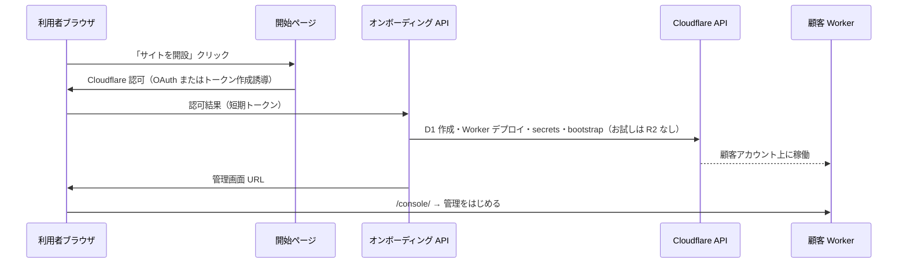

> **履歴（設計メモ）:** 当時の UX 提案です。お試しの正本は [cloudflare-one-click-trial.md](cloudflare-one-click-trial.md)。ドキュメント地図は [docs/README.md](../README.md)。

# 提案: 共通開始ページ → 顧客 Cloudflare アカウント上に開設

## 利用者が見る流れ（製品 UX）

```text
1. baserEdge の「はじめる」ページ（共通 URL、例: https://baseredge.com/start）
2. 「Cloudflare アカウントを持っている」→ 次へ
   （未所持なら dash.cloudflare.com/sign-up へ誘導し、戻ってきたら 2 へ）
3. 「Cloudflare に接続してサイトを開設」ボタン 1 回
4. （裏でデプロイ 1〜3 分）進捗表示
5. 完了 → 自分の管理画面 URL へ自動遷移
6. 「管理をはじめる」1 回 → コンテンツツリー
```

利用者は **npm / Wrangler / D1 の名前を知らなくてよい**。  
インフラは **常に自分の Cloudflare アカウント内**（共有テナントではない）。

---

## 推奨アーキテクチャ（コントロールプレーン + データプレーン）

| 層 | 役割 | 置き場所 |
|----|------|----------|
| **開始ページ** | 説明・同意・「接続」ボタン・進捗 UI | baserEdge 運営（Pages / Worker） |
| **オンボーディング API** | トークン受取・デプロイジョブ・状態・console URL 返却 | baserEdge 運営 Worker（または Workers for Platforms の親） |
| **顧客スタック** | API + Public + D1 + `/console`（お試しは R2 なし） | **顧客 CF アカウント**内の Worker |

イメージ:



既存の `prove:cloudflare` は、**オンボーディング API の中身**（provision → deploy → bootstrap → instant login 設定）としてそのまま流用できる。

---

## Cloudflare への接続方法（3 段階）

### 段階 A — 実証用（最短・OAuth 審査なし）

**「接続」= ユーザーが API トークンを 1 回渡す（ガイド付き）**

1. 開始ページで **権限テンプレート付きリンク** を開く（Cloudflare ダッシュボードの Create Token UI）。
2. 必要スコープ例（アカウント単位・お試し開設）:
   - Account: Workers Scripts Edit, D1 Edit
   - Account: Account Settings Read（account id 取得）
   - （R2 込みフルスタック時のみ R2 Edit — 多くのアカウントで支払い方法が必要）
3. 生成したトークンを開始ページに貼り付け（**HTTPS のみ・サーバで即暗号化・デプロイ完了後に破棄**）。
4. オンボーディング API が REST で `prove` 相当を実行。

| 長所 | 短所 |
|------|------|
| 1〜2 週間で PoC 可能 | 「貼り付け」は本番 UX としては弱い |
| Cloudflare OAuth アプリ登録不要 | 利用者がトークン画面を一度見る |

実証の「共通開始ページ + ボタン」は、**ボタン押下 → モーダルでトークン貼り付け → デプロイ** でもストーリーは成立する。  
のちに **同じ API を OAuth だけ差し替え**。

### 段階 B — 本番に近い（推奨中核）

**Cloudflare OAuth 2.0（または公式に許可された連携フロー）**

1. baserEdge を Cloudflare 側に **OAuth クライアント** として登録（要調査: 一般開発者向けの Account API OAuth の最新手順）。
2. 「接続」クリック → Cloudflare 同意画面 → コールバックで **短期 access token**（+ refresh があれば保管）。
3. オンボーディング API が token で Account ID を解決し、段階 A と同じデプロイパイプラインを実行。
4. トークンは **顧客ごとに暗号化保存**（再デプロイ・更新用）。利用者に貼り付けは不要。

| 長所 | 短所 |
|------|------|
| 利用者は「許可する」だけ | OAuth アプリ・セキュリティレビュー |
| baserCMS 系の「アカウント取得 → ボタン」に一致 | 実装・運用コスト |

**手法が思いつかない**場合の答え: **裏側は「顧客トークンで Cloudflare REST API を叩くデプロイサービス」**で、表の「ボタン」は **OAuth（本番）またはガイド付き API トークン（PoC）** のどちらか。

### 段階 C — スケール（任意）

- **Workers for Platforms**: 親アカウントが顧客 Worker を載せるモデル。顧客 CF アカウントに載せる製品方針と **別モデル**（マルチテナント SaaS 向け）。baserEdge の「顧客自分の CF」方針なら **優先度低**。
- **カスタムドメイン**: 開始ページで `www.example.com` を入力 → デプロイ後に DNS レコード提案（API で自動作成はゾーンが同一アカウントなら可能）。

---

## オンボーディング API がやること（`prove` の製品化）

1. `POST /onboarding/sessions` — ジョブ開始（認可トークン）
2. 非同期:
   - D1 create + migrations apply（[D1 API](https://developers.cloudflare.com/api/resources/d1/subresources/database/methods/create/)）
   - R2 bucket create
   - Worker 2 本 deploy（バンドルは baserEdge がビルド済み artifact を API upload）
   - Secrets 生成・投入
   - `POST /v1/bootstrap`（顧客 Worker へ）
   - `BASER_INSTANT_LOGIN` + owner hint 設定
3. `GET /onboarding/sessions/:id` — `running | succeeded | failed` + `consoleUrl`
4. 完了時: ブラウザを `consoleUrl` へリダイレクト

Wrangler CLI は **サーバ側（CI コンテナ or オンボーディング Worker + 別実行環境）** のみ。利用者 PC では動かさない。

---

## 開始ページの画面要素（最小）

1. **前提チェック**: Cloudflare アカウント作成済みか（自己申告 + サインアップリンク）
2. **主ボタン**: 「Cloudflare に接続してサイトを開設」
3. **進捗**: ステップ表示（接続 → データベース → 公開サイト → 管理画面）
4. **完了**: 管理画面へ + 「この URL をブックマーク」
5. **実証用注記**: preview / instant login（本番は Passkey に切り替え）

---

## セキュリティ・信頼

- トークン・OAuth secret は **顧客ごと KMS 相当で暗号化**（PoC でも平文保存は避ける）。
- 開始ページは **baserEdge 公式ドメインのみ**（フィッシング対策）。
- デプロイ権限は **必要最小限の API トークンスコープ**。
- instant login は **preview のみ**（本番 `production` では無効 — 既存実装どおり）。

---

## おすすめロードマップ

| 順 | 成果物 | 利用者体験 |
|----|--------|------------|
| **1（実装済み PoC）** | `apps/onboarding-web` + `scripts/onboarding/server.mjs` | 開始ページ → トークン貼り付け → 開設 → 管理画面へ自動遷移 |
| 2 | トークン貼り付けを OAuth に差し替え | アカウント取得 → 開始ページ → **ボタン 1 つ** → 管理画面 |
| 3 | ドメイン・メール等のオプション | 同一フロー内で入力 |

### ローカルで開始ページ PoC を動かす

```bash
npm install
npm run dev:onboarding
```

ブラウザ: http://localhost:5174/start/  
（API は http://localhost:8790 ）

利用者フロー: Cloudflare アカウント済み → API トークン作成 → 貼り付け → **「Cloudflare に接続してサイトを開設」** → 完了後 **管理をはじめる**。

---

## 旧ロードマップメモ

**「ボタン 1 クリック」だけを先に見せるなら**: 段階 1 の UI はボタン中心にし、初回だけ裏でトークン作成ウィザード（別タブ）を開く **2 タブ体験** にしておき、段階 2 で真の 1 クリックにする。

---

## 採用しない案（参考）

| 案 | 理由 |
|----|------|
| 利用者 PC で `npm run prove` | 製品要件 DEPLOY-002 に反する |
| 運営の共有 Worker に顧客 CMS | 顧客 CF アカウント方針と不一致 |
| 利用者に wrangler login | CLI 前提で零細向けでない |
| 長期保存のグローバル API キー共有 | セキュリティ上不可 |

---

## 次の実装タスク（リポジトリ内）

1. `apps/onboarding-web` — `/start` 最小 UI（Pages）
2. `apps/onboarding-worker` — セッション + Cloudflare API デプロイ（`scripts/cloudflare/*` をライブラリ化）
3. 段階 A: トークン入力 → `BASER_CF_PROVE` 相当をサーバ実行
4. 段階 B: OAuth コールバック差し替え

関連: [zero-touch-business-demo.md](./zero-touch-business-demo.md)、[baseredge-cloudflare.md](./baseredge-cloudflare.md)、製品要件 DEPLOY-001〜003。
