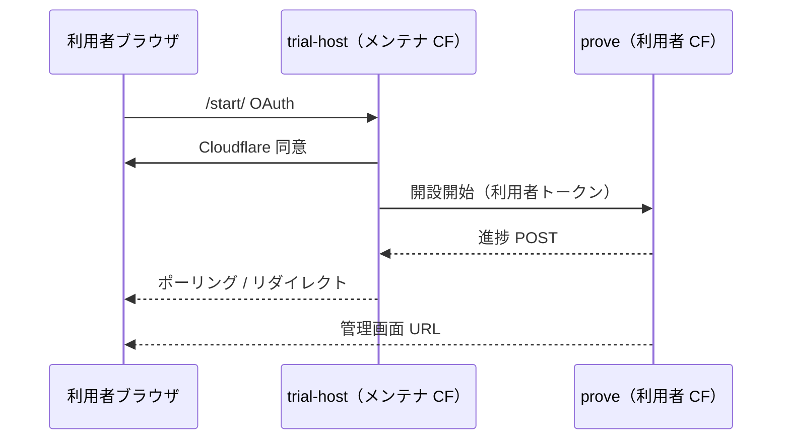

# お試し開設：Cloudflare のみで完結

方針の正本: **[ADR-0023](../adr/0023-trial-provision-without-github-actions.md)**。

## 現在の方式

OAuth `/start/` は、固定リリースと段階Queueを使って **利用者のCloudflareアカウント内**にCMSを開設する。メンテナのGitHub Actionsは使用しない。

## 現在の状態

| 項目 | 現在 |
|---|---|
| 開始画面 | OAuth + 工程別の進捗UI |
| 開設先 | 利用者のCloudflareアカウント |
| 実行方式 | 固定リリース + 暗号化チェックポイント + Queue |
| D1 Migration | 一時Migration WorkerのD1 binding |
| メンテナActions | 使用しない |
| Deployボタン | 開発者向けフォールバック |
| 完了表示 | 管理画面URLと公開サイトURLを画面に保持 |
| 初期コンテンツ | 承認・公開済みの`/home` |

## ターゲット図

## 採用実装（ADR 詳細）

固定アーティファクトを暗号化チェックポイント付きQueueで段階配置する。D1トリガーはcontrol-plane queryへ送らず、認証付きの一時Migration WorkerからD1 bindingで実行する。

## 実装済みチェックリスト

- [x] GitHubなしでOAuth後に利用者アカウントへ`trial`スタックを作成
- [x] 開設ロジックを`packages/cf-trial-provision`へ集約
- [x] D1、Migration、Assets、Worker、Secrets、bootstrapをQueue段階へ分割
- [x] Migration WorkerでTriggerを含む完全なSQLite文を実行
- [x] 全スキーマオブジェクトとMigration台帳を確認
- [x] Worker更新時にSecretとStatic Assets bindingを保持
- [x] `/console/`のHTML配信を成功条件として確認
- [x] 初期`/home`を通常の作成・承認・公開サービスで作成
- [x] 完了画面に管理画面URLと公開サイトURLを表示・保存
- [x] 開設停止を検出して失敗状態へ移行
- [x] Operations WorkerによるOAuth削除導線を提供

## 運用

- 開設状態はtrial-hostのKVセッションとQueue consumerログで確認
- 一般ユーザーの削除は開始ページの**お試しをやめる**、手動削除は[cloudflare-teardown.md](cloudflare-teardown.md)
- **新規の開設ロジックは GitHub に足さない**（ADR-0023）

## 関連

- [trial-oauth-host.md](trial-oauth-host.md) — 現行ホスト手順
- [cloudflare-one-click-trial.md](cloudflare-one-click-trial.md) — 利用者向け説明
