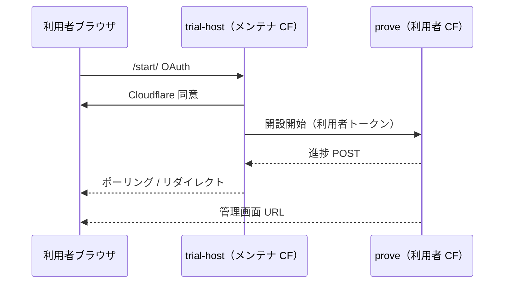

# お試し開設：Cloudflare のみで完結（計画）

方針の正本: **[ADR-0023](../adr/0023-trial-provision-without-github-actions.md)**。

## なぜ変えるか（一言）

今の OAuth `/start/` は **あなたの GitHub Actions** で `runProve` を回す。**壊れやすく、無料枠も減る。**  
ユーザー体験はそのまま、**工事は利用者の Cloudflare だけ**に移す。

## いま vs あと

| | 今（暫定） | あと（目標） |
|---|------------|--------------|
| 画面 | OAuth + 進捗 UI | 同じ |
| prove の場所 | メンテナ **GitHub Actions** | 利用者 **Cloudflare** のみ |
| メンテナ Actions | 1 開設 ≒ 1 本 | **0** |
| Deploy ボタン | もともと CF のみ | 変更なし（フォールバック） |

## ターゲット図

## 実装候補（ADR 詳細）

1. **Workers Builds** — Deploy ボタンと同系。OAuth 後に利用者アカウントでビルド起動（第一候補）。
2. **固定アーティファクト + REST** — ビルドはメンテナが版固定。prove は D1 + Worker API のみ（軽量）。
3. Containers 等 — 最後の手段。

## Phase チェックリスト

### Phase 1 — スパイク

- [ ] Cloudflare ドキュメントで「OAuth 後に利用者アカウントで Builds / デプロイを起動」可能か確認
- [ ] 手動で 1 アカウントに `trial` スタックを立て、**GitHub を触らない**ことを確認
- [ ] 進捗を trial-host の `POST /api/onboarding/internal/progress` と同型で返せるか検証

### Phase 2 — 製品配線

- [ ] `apps/onboarding-worker` から `dispatchGithub` / `GH_DISPATCH_TOKEN` を削除
- [ ] prove 起動を新モジュール（例: `packages/cf-trial-provision`）に集約
- [ ] `/start/` E2E：成功・失敗が UI に必ず出る（Actions コールバック不要）
- [ ] `docs/deployment/trial-oauth-host.md` から GitHub Secrets 節を削除または「廃止」

### Phase 3 — 片付け

- [ ] `.github/workflows/onboarding-jobs.yml` の `prove` ジョブ削除（`destroy` も CF 化するか別 ADR）
- [ ] D1 再試行: `apply-d1-migrations` の「ledger のみ」誤判定を直す（Actions 有無と独立）

## 暫定運用（Phase 2 まで）

OAuth ホストを使い続ける場合:

- Actions 失敗は [Actions の onboarding-jobs](https://github.com/imagawatatsuya/baser-edge/actions/workflows/onboarding-jobs.yml) で確認
- 手動削除は [cloudflare-teardown.md](cloudflare-teardown.md) または Operations Worker（OAuth 要設定）
- **新規の開設ロジックは GitHub に足さない**（ADR-0023）

## 関連

- [trial-oauth-host.md](trial-oauth-host.md) — 現行ホスト手順（暫定 Actions あり）
- [cloudflare-one-click-trial.md](cloudflare-one-click-trial.md) — 利用者向け説明
